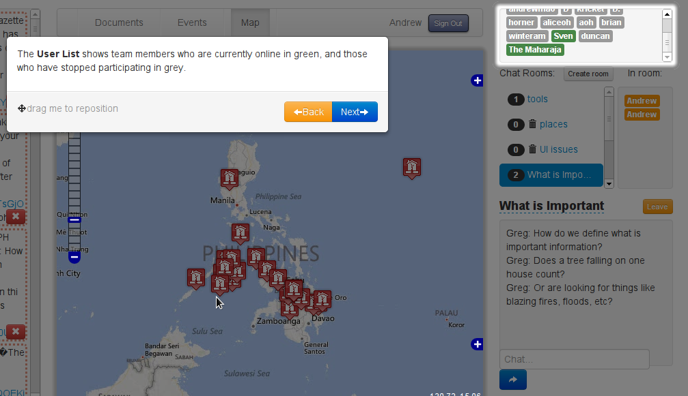
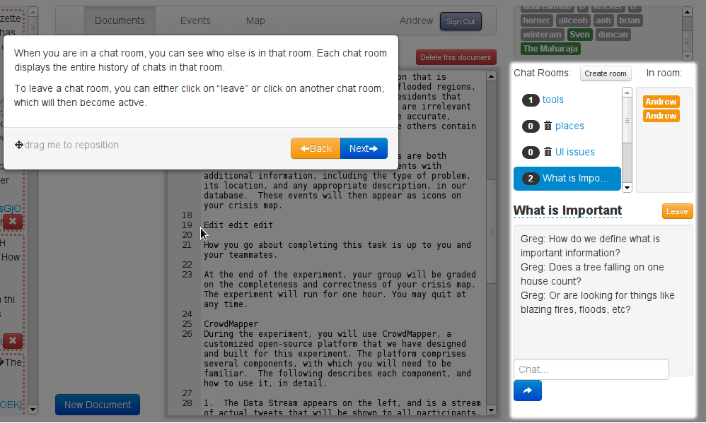

meteor-tutorials
================

## What's this do?

Easily create super cool animated tutorials for your Meteor app. This package gives you a dirt easy way to make multi-step tutorials that spotlight multiple parts of your user interface. What a great way to show off how awesome your Meteor app is!

[See a demo](http://testtut.meteor.com/).

Here's one of my apps. Among other things, it has a list of online users (provided by the [user-status package](https://github.com/mizzao/meteor-user-status)) and a chat room. As users go through the tutorial, which has several steps, the tutorial explains different parts of the user interface to them.



Later on, the chat room is shown:



The awesomeness of this tutorial is that it's completely autogenerated and moves with your code. All you have to do is specify the templates for each step and a selector for what should be spotlighted, and the spotlight and modal positions are computed automatically. This means that you won't have to hardcode anything or do much maintenance when your app changes. Best of all, it's animated and looks great!

## Install

Install with Meteorite:

```
meteor add mizzao:tutorials
```

## Usage

First, specify some templates for your tutorial. Easy as pie:

```html
<template name="tutorial_step1">
    This is step 1 of the tutorial.
</template>

<template name="tutorial_step2">
    This is step 2 of the tutorial.
</template>
```

Next, define the steps of your tutorial in a helper accessible by whatever template is drawing the tutorial.

```js
tutorialSteps = [
  {
    template: Template.tutorial_step1,
    onLoad: function() { console.log("The tutorial has started!"); }
  },
  {
    template: Template.tutorial_step2,
    spot: ".myElement, .otherElement",
    require: {
      event: "something-emitted",
      validator: function(args) { ... }
    }
  }
];

Template.foo.helpers({
  options: {
    id: "myCoolTutorial",
    steps: tutorialSteps,
    emitter: new EventEmitter(),
    onFinish: function() { /* make the tutorial disappear */ }
  }
});
```

The `id` field of the options is optional. If provided, it preserves the current step of the tutorial across a hot code reload by saving it in a `Session` variable. You will probably find this very useful when testing your tutorial.

The steps of the tutorial should be an array of objects, which take the following form:

- `template`: (**required**) The template that should be displayed in the modal for this step. You can specify this either directly as a `Template.foo` object, or as a string like `"foo"`.
- `spot`: (*optional*) jQuery selector of elements to highlight (can be a single selector or separated by commas). If multiple elements are selected, the tutorial automatically calculates a box that will fit around all of them.
- `onLoad`: (*optional*) a function that will run whenever the tutorial hits this step. Helpful if you need to make sure your interface is in a certain state before displaying the tutorial contents.
- `require`: (*optional*) an object with an `event` argument and an optional `validator` function to listen for a required user or other action to happen before the **Next** or **Finish** buttons appear. Used in conjunction with an `EventEmitter` instance, as below.

Now, just call the `tutorial` helper with your `steps` from a template whose [offset parent](http://api.jquery.com/offsetParent/) is the same size as the body. This is necessary because the tutorial content is absolutely positioned relative to the window.

```html
<template name="foo">
  {{! My cool user interface}}

  {{#if tutorialEnabled}}
    {{> tutorial options}}
  {{/if}}
<template>
```

To require users to do certain actions to proceed through the tutorial, pass an object that satisfies the Node [`EventEmitter`](http://nodejs.org/api/events.html) signature via the `emitter` field in the options. The tutorial will bind listeners to all the events specified in `require` fields and check them with the `optional` validator. The event will need to be fired before the the tutorial can be continued, but they don't need to happen on the same step that it is shown, and the tutorial will remember the state of the events across steps. Use the `stepCompleted` helper in a tutorial template to render different text depending on whether the user has completed the required action (see examples).

Enjoy as your users learn how to use your app much quicker!

### Examples

- [Example code](examples) is available. Thanks [geekyme](https://github.com/geekyme) for getting it started.
- Check out the tutorial code for Crowdmapper: [code](https://github.com/mizzao/CrowdMapper/blob/master/client/tutorial/tutorial.coffee) and [templates](https://github.com/mizzao/CrowdMapper/blob/master/client/tutorial/tutorial.html).

### Notes

- I didn't know about it when I conceived this, but this is very similar to [intro.js](http://usablica.github.io/intro.js/). However, it uses Meteor's templating and reactive capabilities, so in my opinion it's much more powerful.
